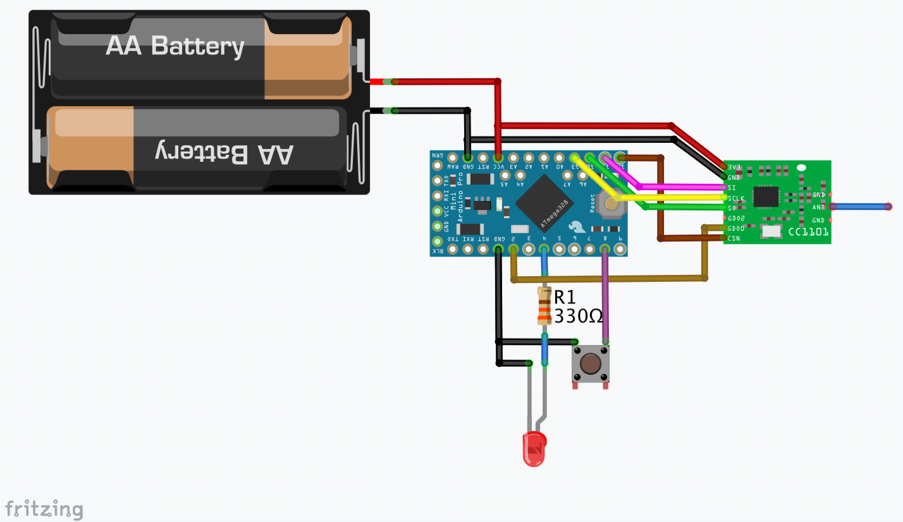
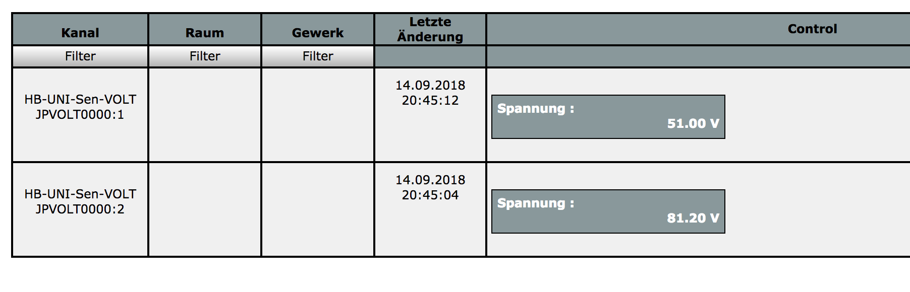

# HB-UNI-Sen-VOLT
universeller HomeMatic Spannungssensor

** Es handelt sich hierbei nur um ein Template. Die Messroutine muss je nach eigenen Vorstellungen selbst eingebaut werden. Siehe auch: https://homematic-forum.de/forum/viewtopic.php?f=76&t=44871&p=455253#p454899 **

